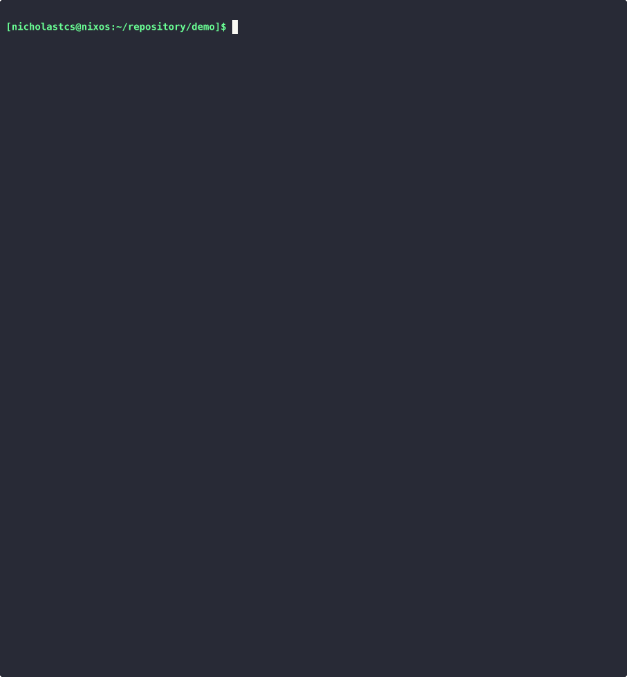

# Alchemy

Alchemy, an corporateless/vendorless platform-agnostic template CLI.

Alchemy is a command-line interface that enables handoff of the Golden Pattern codes from the Platform engineers to the Software developers.

It is to empowers Platform engineers to deliver no-frills fill-the-form generated IAC without managing a full fledged Internal Developer Portal (IDP).

It is a low-cost IDP hosted by your Git that are good for small-medium team!

## Key features

* **Generating Golden Patterns**: Golden patterns can be generated with step-by-step form.

* **Language & Vendor Agnostic**: Alchemy has no knowledge of the technology of the underlying template, so you can template anything you want. This includes:

  * Create Start-up application or microservice templates,

  * Create Application IAC code (Kubernetes manifests, Terraform, Pulumi, etc.)

* **API Driven**: Forms are generated with YAML. The YAML is statictally compiled into the CLI and consumed by software developers. 

  Form UI is powered by [Charmbracelet Huh Terminal Form](https://github.com/charmbracelet/huh).

* **CEL Expression Validation**: User values are validated on-the-go with powerful CEL expression [CEL expression evaluation](https://github.com/google/cel-go).

  * No floating container image tag? - `!this.endsWith(":latest")`

  * Application replicas must be greater than 0? - `this > 0`

  * Kubernetes resource value evaluation? - `quantity(this) >= quantity("500m")`

  * Non-empty string value? - `this.size() > 0`

* **Alchemy is non-profit**: So it will work for everything you throw at it.

* **Alchemy is not**: It is not the tool to replace mainstream/native templating tools like:
  * Terraform modules
  * Helm
  * Kustomize
  * AWS Cloudformation stack, etc.

  But to supplement on top of them with user inputs! Its like as a soft landing for your creations above!

## Persona

### Platform/SRE/Cloud/DevOps operator

1. Fork the `alchemy` repository to your private repository,

2. Crafts Resource YAML with `Forms` and `CodeTemplate` APIs,

3. Embed the YAML into the `embed/` directory,

4. Merge to master.

### Software Developers

1. Use `go install` on the private repository,

2. Run `alchemy transmute -n <NAMESPACE> <FORM_NAME> -t <CODE_TEMPLATE_NAME>`.

3. Consume the generated IAC or golden pattern!

## Prototype Demo

